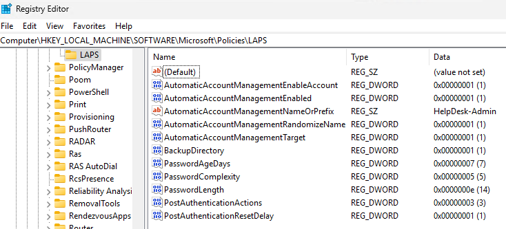

# Windows LAPS

<!-- Start Document Outline -->

* [What is Windows LAPS](#what-is-windows-laps)
* [Windows LAPS supported platforms](#windows-laps-supported-platforms)
* [Important notes:](#important-notes)
* [Configuration settings](#configuration-settings)
* [Legacy MS Laps vs Windows LAPS](#legacy-ms-laps-vs-windows-laps)
* [Event Log:](#event-log)
* [Registry:](#registry)

<!-- End Document Outline -->

## What is Windows LAPS

Every Windows machine has a built-in local administrator account that can't be deleted, and which has full permissions to the device. Securing this account is an important step in securing your organization. Windows devices include Windows Local Administrator Password Solution (LAPS), a built-in solution to help manage local admin accounts.

## Windows LAPS supported platforms
Windows LAPS is available on the following OS platforms:

* Windows client
* Windows 11 23H2 and later.
* Other versions of Windows client that have received the April 11, 2023 Update or later, including:
    * Windows 11 22H2 - April 11 2023 Update and later.
    * Windows 11 21H2 - April 11 2023 Update and later.
    * Windows 10 - April 11 2023 Update and later.
    
**Note:** ==*The Automatic Account Management CSP settings require Windows 11 24H2 or later.*==

## Important notes:

* Devices that are workplace-joined (WPJ) are not supported by Intune for LAPS.
* Windows LAPS is supported for GCC High environments (Microsoft 365 GCC High is a specialized, highly secure, and compliant cloud environment designed for U.S. government contractors (handling CUI or ITAR data) and federal agencies). 
* The **Remote tasks** action of Rotate Local Admin Password is not included by any Intune built-in role or the Microsoft Entra built-in role of Intune Administrator. Instead, use a custom Intune role to assign this permission to users who should have this capability.
* RBAC Roles Supported: Endpoint Security Manager, Read Only Operator.
* Automatic LAPS management supports on Windows 11 24H2, Windows Server 2025 and  releases later. It does not support on Windows 10.
* LAPS on Windows devices can be configured to use one directory type or the other, but not both. Also consider, the backup directory must be supported by the devices join type - if you set the directory to an on-premises Active Directory and the device is not domain joined, it will accept the policy settings from Intune, but LAPS cannot successfully use that configuration.

| Device join type                   | Supported LAPS backup directory |
|------------------------------------|---------------------------------|
| Entra ID joined only               | Entra ID only                   |
| Hybrid joined (Entra + on-prem AD) | Either, but not both            |
| Domain-joined only (no Entra)      | On-prem AD only                 |

**Summary in simple terms**
* Pick one backup location — either Azure AD (Entra ID) or on-prem AD.
* The device must actually be joined to that directory — otherwise Intune will happily apply the policy, but LAPS won’t work.

## Configuration settings

* **Backup Directory:** Use this setting to configure which directory the local admin account password is backed up to. The allowable settings are: 0=Disabled (password will not be backed up) 1=Backup the password to Microsoft Entra ID only 2=Backup the password to Active Directory only. If not specified, this setting will default to 0. 
* **Password Age Days:** Use this policy to configure the maximum password age of the managed local administrator account. If not specified, this setting will default to 30 days. This setting has a minimum allowed value of 1 day when backing the password to on-premises Active Directory, and 7 days when backing the password to Azure AD. This setting has a maximum allowed value of 365 days.
* **Administrator Account Name:** Use this setting to configure the name of the managed local administrator account. If not specified, the default built-in local administrator account will be located by well-known SID (even if renamed). If specified, the specified account's password will be managed. Note: if a custom managed local administrator account name is specified in this setting, that account must be created via other means. Specifying a name in this setting will not cause the account to be created.
* **Password Complexity:** Use this setting to configure password complexity of the managed local administrator account. The allowable settings are: `1=Large letters` `2=Large letters + small letters` `3=Large letters + small letters + numbers` `4=Large letters + small letters + numbers + special characters`. If not specified, this setting will default to 4.
* **Password Length:** Use this setting to configure the length of the password of the managed local administrator account. If not specified, this setting will default to 14 characters. This setting has a minimum allowed value of 8 characters. This setting has a maximum allowed value of 64 characters.
* **Post Authentication Actions:** Use this setting to specify the actions to take upon expiration of the configured grace period. If not specified, this setting will default to 3 (Reset the password and logoff the managed account).
* **Post Authentication Reset Delay:** Use this setting to specify the amount of time (in hours) to wait after an authentication before executing the specified post-authentication actions. If not specified, this setting will default to 24 hours. This setting has a minimum allowed value of 0 hours (this disables all post-authentication actions). This setting has a maximum allowed value of 24 hours.
**Example:** `Post Authentication Reset Delay` setting set to 1 hr, after the 1 hr time limit `Post Authentication Actions` takes place.

    
* **Automatic Account Management Enabled:** Use this setting to specify whether automatic account management is enabled. If this setting is enabled, the target account will be automatically managed. If this setting is disabled, the target account will not be automatically managed. If not specified, this setting defaults to False.
* **Automatic Account Management Enable Account:** Use this setting to configure whether the automatically managed account is enabled or disabled. If this setting is enabled, the target account will be enabled. If this setting is disabled, the target account will be disabled. If not specified, this setting defaults to False.
* **Automatic Account Management Randomize Name:** Use this setting to configure whether the name of the automatically managed account uses a random numeric suffix each time the password is rotated. If this setting is enabled, the name of the target account will use a random numeric suffix. If this setting is disabled, the name of the target account will not use a random numeric suffix. If not specified, this setting defaults to False.
* **Automatic Account Management Target:** Use this setting to configure which account is automatically managed. The allowable settings are: 0=The built-in administrator account will be managed. 1=A new account created by Windows LAPS will be managed. If not specified, this setting will default to 1.
* **Automatic Account Management Name Or Prefix:** Use this setting to configure the name or prefix of the managed local administrator account. If specified, the value will be used as the name or name prefix of the managed account. If not specified, this setting will default to 'WLapsAdmin'.

## Legacy MS Laps vs Windows LAPS

| Feature                          | Legacy Microsoft LAPS                              | Windows LAPS                                                                 |
|----------------------------------|----------------------------------------------------|------------------------------------------------------------------------------|
| Integration                      | Requires separate installation via MSI             | Built into Windows 10, 11, and Server platforms (with updates from April 2023 or later) |
| Password Storage Options         | Active Directory only                              | Supports both Active Directory and Azure Active Directory for password storage |
| Password Encryption              | Not available                                      | Supports encryption of passwords in Windows Server Active Directory          |
| Password History                 | Not available                                      | Stores password history for auditing or recovery purposes                    |
| DSRM Account Management          | Not supported                                      | Can manage and back up Directory Services Restore Mode (DSRM) passwords on domain controllers |
| Automatic Actions                | Limited                                            | Includes automatic responses to password usage (e.g., resetting after retrieval) |
| Migration Support                | Not applicable                                     | Offers a legacy emulation mode to ease migration from legacy Microsoft LAPS  |

## Event Log:

Application and Services logs  &rarr; Microsoft  &rarr; Windows  &rarr; LAPS  &rarr; Opertaional

## Registry:

