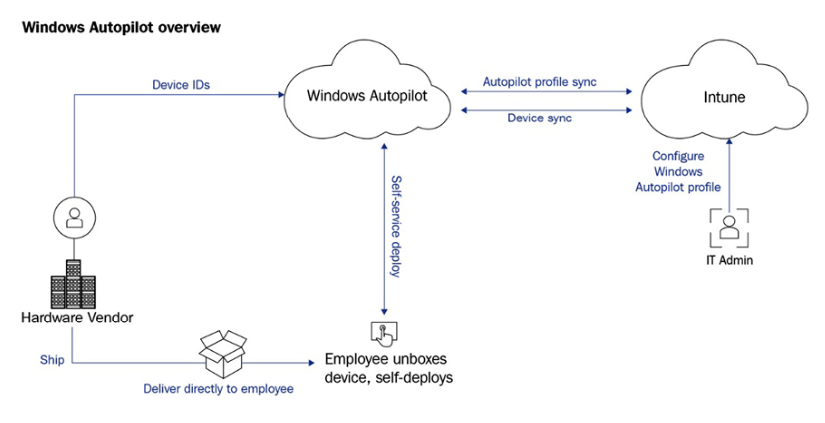
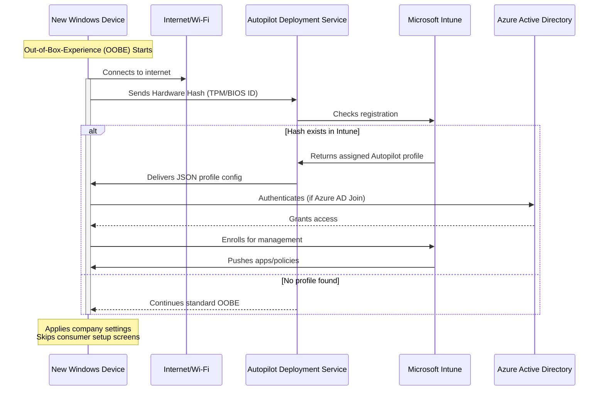
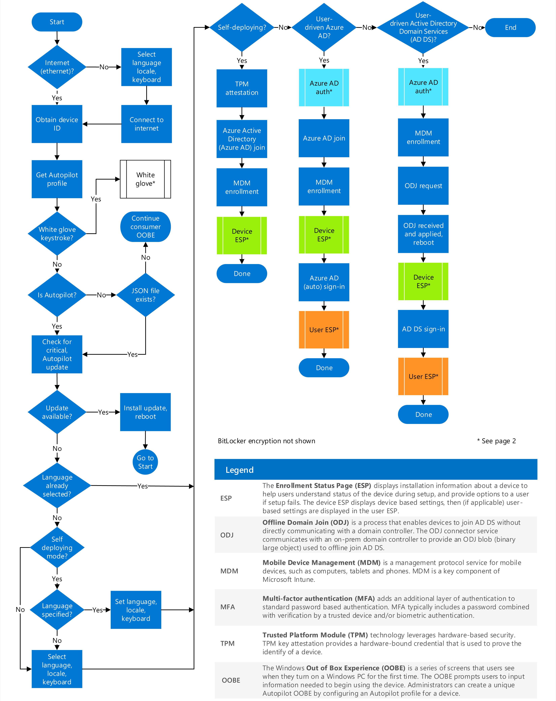
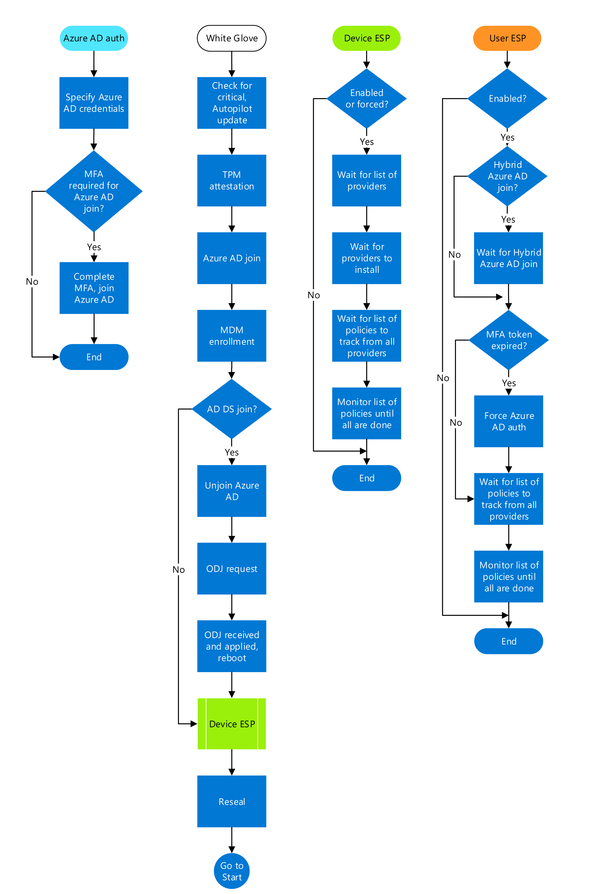
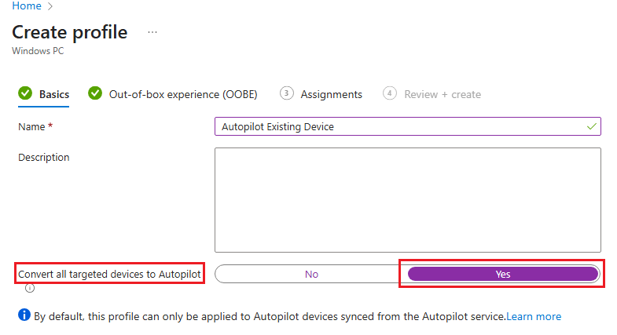
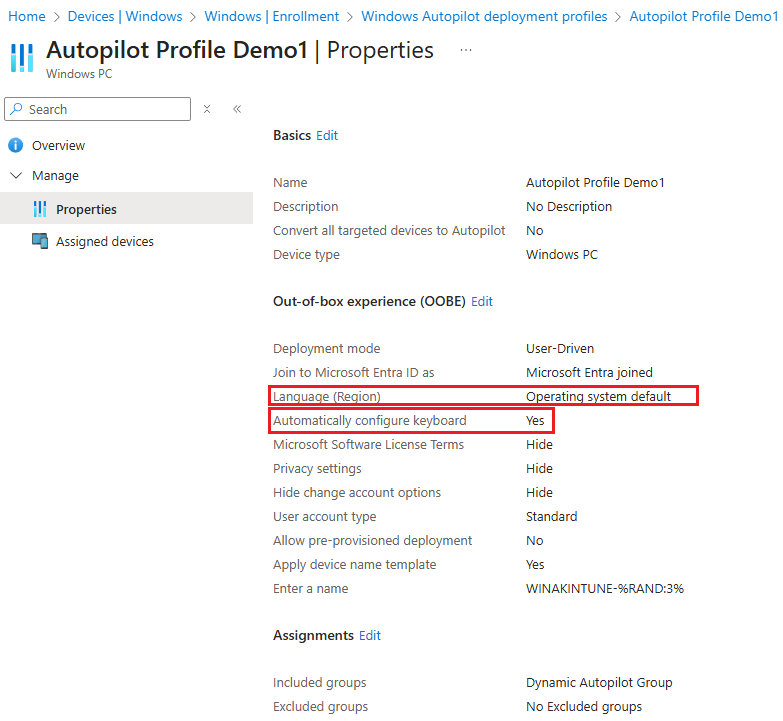

# Windows Autopilot
<!-- Start Document Outline -->

* [Windows Autopilot](#windows-autopilot)
	* [✅ Technical Requirements](#-technical-requirements)
	* [Windows Autopilot Overview](#windows-autopilot-overview)
	* [Uploading the hardware ID to Windows Autopilot](#uploading-the-hardware-id-to-windows-autopilot)
		* [Command](#command)
			* [CSV file contents](#csv-file-contents)
	* [How to decode Hardware hash](#how-to-decode-hardware-hash)
	* [Step-by-Step Process](#step-by-step-process)
		* [1. Device Boots Up for the First Time (OOBE)](#1-device-boots-up-for-the-first-time-oobe)
		* [2. Device Connects to the Internet](#2-device-connects-to-the-internet)
		* [3. Device Sends Its Hardware Hash to Microsoft](#3-device-sends-its-hardware-hash-to-microsoft)
		* [4. Microsoft Checks for an Autopilot Profile](#4-microsoft-checks-for-an-autopilot-profile)
		* [5. Device Downloads & Applies the Profile](#5-device-downloads--applies-the-profile)
		* [6. Complete visualization diagram](#6-complete-visualization-diagram)
	* [Autopilot Flowchart](#autopilot-flowchart)
	* [Autopilot for existing devices](#autopilot-for-existing-devices)
		* [Using Windows Autopilot for Existing Devices with Traditional Deployment Tools](#using-windows-autopilot-for-existing-devices-with-traditional-deployment-tools)
		* [Exporting an Autopilot Profile from Microsoft Intune](#exporting-an-autopilot-profile-from-microsoft-intune)
		* [Steps to Create the JSON File](#steps-to-create-the-json-file)
		* [Grouping Devices with a Correlator ID](#grouping-devices-with-a-correlator-id)
		* [Out-of-box experience (OOBE) - Important Note](#out-of-box-experience-oobe---important-note)
	* [Windows updates during the OOBE](#windows-updates-during-the-oobe)
		* [Mandatory Updates During Windows Autopilot Provisioning](#mandatory-updates-during-windows-autopilot-provisioning)
		* [Automatic Update Process:](#automatic-update-process)
		* [Exclusions During OOBE:](#exclusions-during-oobe)
		* [User Notification:](#user-notification)
		* [Driver Management in Windows Autopilot](#driver-management-in-windows-autopilot)
			* [Recommended Approach:](#recommended-approach)
		* [Autopilot Profile Assignment Methods in Microsoft Intune](#autopilot-profile-assignment-methods-in-microsoft-intune)
			* [The Zero Touch Deployment ID (ZTDID)](#the-zero-touch-deployment-id-ztdid)

<!-- End Document Outline -->


## :white_check_mark: Technical Requirements
Windows Autopilot has some prerequisites:

	• Microsoft Entra ID automatic enrollment needs to be configured.
	• The user needs an Intune license.
	• Microsoft Entra ID P1 or P2 subscription
	• The device needs to be registered in the Windows Autopilot service.
	• Entra ID branding needs to be configured.
## Windows Autopilot Overview

<small>Windows Autopilot is a provisioning method for modern devices. 
It is not OSD in the traditional manner.
Windows Autopilot requires a cloud identity and cloud device identity, which can be either a hybrid Entra ID join or an  Entra ID join.</small>

* <small> You get started with Autopilot by getting your devices uploaded to the Autopilot service, creating and assigning an Autopilot profile.
* Then creating and assigning an ESP profile (this step is optional but recommended).
* After your device is shipped, the user simply has to enter their credentials before automatic enrollment starts.
* After entering the correct credentials, you will be met by the Entra ID sign-in workflow.
* Then, enrollment starts, and all your configuration items, policies, certificates, and applications are applied to your physical endpoint device.
* As soon as this phase is completed, the user can see the desktop.
* Windows Autopilot data is stored within the European Union (EU), and not in the region where your Entra ID tenant is located.
* It is not customer data that is stored, but business data, which enables Microsoft to provide the Windows Autopilot service, and customers can always opt out of the Windows Autopilot service.
</small>

## Uploading the hardware ID to Windows Autopilot
The Windows Autopilot hardware hash is a 4K string retrieved from the Windows 10 or Windows 11 OS on the device by running `Get-WindowsAutoPilotInfo.ps1`

### Command
**Offline:**
```powershell
Install-Script -Name Get-WindowsAutoPilotInfo
Get-WindowsAutoPilotInfo.ps1 -OutputFile Hash.csv
```
Collect the csv and upload to the listed location below in Intune.

>  Devices &rarr; Enrollment &rarr; Windows (tab) &rarr; Windows Autopilot (section) &rarr; Devices

#### CSV file contents

The csv file contains the listed below.

* Device Serial Number
* Windows Product ID
* Hardware Hash
* GroupTag (optional)
* Assigned user (optional)

The recommended way to get your brand-new devices into the Windows Autopilot service is to have your OEM or a Microsoft Cloud Solution Provider (CSP) partner upload the information.

**Online:**
```powershell
Set-ExecutionPolicy Bypass -Force
Install-PackageProvider Nuget -Confirm:$false -Force
Install-Module WindowsAutopilotIntune -Force
Install-Script -Name Get-WindowsAutoPilotInfo -Force
Get-WindowsAutoPilotInfo.ps1 -GroupTag "GroupName" -Online
```
* We can ignore group tag if we want to go by default "ZTDid"
* -online switch opens up the Authentication window.. Need to enter our Intune tenant login details and get authenticated so the device get registered.
* Once device is added, we need to wait for the profile status to assigned then go for autopilot OOBE process.
* we can have up to 500 rows in the CSV file.
* The header and line format in the CSV file which include the ***device serial number***, the ***Windows product ID***, the ***hardware hash***, the ***Optional group tag***, and the ***Optional assigned user***.
```
<serialNumber>,<ProductID>,<hardwareHash>,<optionalGroupTag>,<optionalAssignedUser>
 ```
## How to decode Hardware hash
* Download **Windows Assessment and Deployment Kit (ADK)**.
* Select Deployment Tools feature and install.
* Following the installation of the Windows ADK, you can find the tool you need here:
> C:\Program Files (x86)\Windows Kits\10\Assessment and Deployment Kit\Deployment Tools\amd64\Licensing\OA30\oa3tool.exe
* Run the following command:
```
oa3tool.exe /DecodeHwHash=HardwareHash
```
* Then, you’ll get the decoded result of what is stored in the hardware hash.
```XML
OEM Activation Tool 3.0
(c) Copyright 2023 Microsoft Corp.
Version: 10.0.25398. 
<?xml version="1.0"?>
<HardwareReport>
     <HardwareInventory>
           <p n="ToolVersion" v="3" />
           <p n="HardwareInventoryVersion" v="131" />
           <p n="ToolBuild" v="10.0.17134.1" />
           <p n="OSType" v="FullOS" />
           <p n="OsCpuArchitecture" v="x64" />
           <p n="OsBuild" v="10.0.17134.1" />
           <p n="OsSystemTime" v="2018-05-18T12:51:13Z" />
           <p n="OsLocalTime" v="2018-05-19T18:51:13+30:00" />
           <p n="ProcessorModel" v="     Intel(R) Xeon(R) CPU E3-1220L V2 @ 2.30GHz" />
           <p n="ProcessorPackages" v="1" />
           <p n="ProcessorThreads" v="2" />
           <p n="ProcessorCores" v="2" />
           <p n="ProcessorHyperThreading" v="false" />
           <p n="SmbiosRamArrayCount" v="1" />
           <p n="SmbiosRamSlots" v="1" />
           <p n="SmbiosRamErrorCorrection" v="None" />
           <p n="SmbiosRamMaximumCapacity" v="2048" />
           <p n="TotalPhysicalRAM" v="2" />
           <p n="SmbiosFirmwareVendor" v="Microsoft Corporation" />
           <p n="SmbiosSystemManufacturer" v="Microsoft Corporation" />
           <p n="SmbiosSystemProductName" v="Virtual Machine" />
           <p n="SmbiosSystemSerialNumber" v="2378-0002-7885-9434-1355-6165-71" />
           <p n="SmbiosUuid" v="192a7ab2-4b1d-4433-9026-
```


## Step-by-Step Process

**Scenario:**
You’ve just unboxed a new Windows laptop (or reset an existing one). Instead of manually setting it up, Autopilot automates the process based on a pre-configured profile.

### 1. Device Boots Up for the First Time (OOBE)

When you power on the device, it starts the Out-of-Box Experience (OOBE)—the initial setup screen.
```
[Power On] → [Windows Logo] → [“Hi, let’s get your device ready”]  
```
### 2. Device Connects to the Internet
The device must have network access (Wi-Fi/Ethernet) to contact Microsoft’s Autopilot service.
```
[“Connecting to network…”]  
   ↓  
[Wi-Fi/Ethernet Connected]  
```
### 3. Device Sends Its Hardware Hash to Microsoft
The device reads its unique hardware hash (like a fingerprint) from the motherboard.

It sends this hash to:
* Autopilot Deployment Service (ztd.dds.microsoft.com)
* Azure AD (login.microsoftonline.com)
```
[Device]  
   │  
   ├───Sends Hardware Hash (ABCD-1234-EFGH-5678)  
   │       │  
   │       ▼  
   │  [Microsoft Cloud]  
   │  (Checks if hash matches an Autopilot profile)  
   │  
   ▼  
[Waiting for response...]  
```
### 4. Microsoft Checks for an Autopilot Profile
Microsoft’s cloud checks:

* Is this device registered in Intune/Autopilot?
* Does it have a profile assigned?
```
[Microsoft Cloud]  
   │  
   ├───"Is ABCD-1234-EFGH-5678 in our database?"  
   │       │  
   │       ▼  
   │  ✅ "Yes! This device belongs to **Contoso Inc.**"  
   │  ✅ "Profile found: **Standard User Setup**"  
   │  
   ▼  
[Sending profile to device...]  
```
### 5. Device Downloads & Applies the Profile
The device receives a JSON-based Autopilot profile with settings like:

* Skip privacy screens
* Auto-enroll in Intune
* Install company apps
```
[Device applies profile]  
   │  
   ├───► Skips OEM setup  
   ├───► Joins Azure AD automatically  
   ├───► Installs Company Portal  
   │  
   ▼  
[“Welcome to Contoso!” – Device is ready for use]  
```
### 6. Complete visualization diagram


## Autopilot Flowchart

***Page 1:***

**Note:** <mark style="background-color: lightblue">Pre-Provisioning is the latest name of White Glove.</mark>

***Page 2:***

## Autopilot for existing devices
* If you prefer not to manually collect and upload device information to Autopilot, alternative methods are available.
* For devices already managed in Intune whether they are Microsoft Entra ID-joined or co-managed you can use the "Convert all targeted devices to Autopilot" option within the Autopilot profile.

* By enabling this setting, all eligible devices in the assigned group(s) will be automatically registered with Autopilot if they aren’t already.
* Once registered, these devices will follow the assigned Autopilot deployment process during their next Windows Out-of-Box Experience (OOBE).
* Note that this setting does not convert existing Microsoft Entra hybrid-joined devices into Microsoft Entra ID only devices it solely registers them with the Autopilot service.
### Using Windows Autopilot for Existing Devices with Traditional Deployment Tools
* Windows Autopilot can also be applied to existing devices through traditional OS deployment methods, such as Microsoft Endpoint Manager aka (SCCM) or the Microsoft Deployment Toolkit (MDT).
* To implement this, simply place the Autopilot profile JSON file in the following directory
```
%windir%\provisioning\AutoPilot\AutopilotConfigurationFile.json
```
* **Note:** Administrative privileges are required on the target Windows device to perform this action.
### Exporting an Autopilot Profile from Microsoft Intune
* If you’ve already created an Autopilot profile in Intune, you can export it using the WindowsAutopilotIntune PowerShell module.
* Running the appropriate cmdlet will display a list of all Autopilot profiles in your tenant.
```Powershell
Install-Module WindowsAutopilotIntune -Force
Install-Module Microsoft.Graph.Intune -Force
Connect-MgGraph
Get-Autopilotprofile
```
* For example, once you retrieve the profile list, you can use the profile ID to extract and convert it into the necessary JSON format. 
```
Get-AutopilotProfile

Name                           Value
----                           -----
createdDateTime                10/15/2024 6:30:11 AM
lastModifiedDateTime           10/31/2024 9:42:58 AM
enableWhiteGlove               False
@odata.type                    #microsoft.graph.azureADWindowsAutopilotDeploymentProfile
hardwareHashExtractionEnabled  False
extractHardwareHash            False
deviceType                     windowsPc
deviceNameTemplate             WINAKINTUNE-%RAND:3%
outOfBoxExperienceSetting      {userType, keyboardSelectionPageSkipped, eulaHidden, privacySettingsHidden...}
roleScopeTagIds                {0}
language                       os-default
id                             43bcf03a-ea70-438e-a633-25eb0a67112b
managementServiceAppId
displayName                    Autopilot Profile Demo1
preprovisioningAllowed         False
enrollmentStatusScreenSettings
outOfBoxExperienceSettings     {userType, skipKeyboardSelectionPage, hideEscapeLink, hideEULA...}
description
locale                         os-default
```
* After retrieving an Autopilot profile using its unique ID, you can convert it into the required JSON format for deployment. 

```
Get-AutopilotProfile -id 43bcf03a-ea70-438e-a633-25eb0a67112b | ConvertTo-AutopilotConfigurationJSON

{
    "CloudAssignedDomainJoinMethod":  0,
    "CloudAssignedDeviceName":  "WINAKINTUNE-%RAND:3%",
    "CloudAssignedAutopilotUpdateTimeout":  1800000,
    "CloudAssignedForcedEnrollment":  1,
    "Version":  2049,
    "CloudAssignedTenantId":  null,
    "CloudAssignedAutopilotUpdateDisabled":  1,
    "ZtdCorrelationId":  "43bcf03a-ea70-438e-a633-25eb0a67112b",
    "Comment_File":  "Profile Autopilot Profile Demo1",
    "CloudAssignedAadServerData":  "{\"ZeroTouchConfig\":{\"CloudAssignedTenantUpn\":\"\",\"ForcedEnrollment\":1,\"CloudAssignedTenantDomain\":null}}",
    "CloudAssignedOobeConfig":  1310,
    "CloudAssignedTenantDomain":  null,
    "CloudAssignedLanguage":  "os-default"
}
```
### Steps to Create the JSON File
* Copy the Autopilot profile content.
* Paste it into Notepad (or a text editor).
* Save the file as AutopilotConfigurationFile.json.
### Grouping Devices with a Correlator ID
When enrolling existing devices via Configuration Manager Autopilot, you can group them using a correlator ID (ZtdCorrelationId). This ID is included in the Autopilot configuration file.
* The enrollmentProfileName attribute in Microsoft Entra ID is automatically set to: ***OfflineAutopilotprofile-correlator ID***
* This allows you to create dynamic Entra ID groups based on the correlator ID by filtering on the ***enrollmentProfileName*** attribute.

### Out-of-box experience (OOBE) - Important Note


**Language (Region) Settings:**
For the selected language (region) to take effect during OOBE (Out-of-Box Experience), an Ethernet connection must be active. Without it, the OOBE wizard will prompt the end user for input. Additionally, the OS default language will only apply if the operating system is configured for a single language. For example, if the OS supports both en-US and nl-NL, the OOBE wizard page will still appear.

**Automatic Keyboard Configuration:**
Similarly, the automatic keyboard setup feature requires an Ethernet connection during OOBE to function properly. If no connection is available, the OOBE wizard will display the keyboard configuration page to the user.

**Unattend.xml Consideration:**
If an unattend.xml file is present on the device during OOBE, Windows Autopilot may fail. When imaging existing devices, ensure that no unattend files remain in the following locations:
```Text
%WINDIR%\Panther\Unattend\unattend.xml
%WINDIR%\Panther\unattend.xml
```
## Windows updates during the OOBE
### Mandatory Updates During Windows Autopilot Provisioning
IT administrators cannot skip critical updates during Windows Autopilot provisioning, as these are essential for proper device functionality.

### Automatic Update Process:

* Critical driver updates and Windows Zero-Day Patch (ZDP) updates start downloading automatically during OOBE once the device connects to a network.
* After these initial updates, Autopilot functional and critical updates are also downloaded and installed without user intervention.

### Exclusions During OOBE:
Feature updates and quality updates are not applied in this phase.

### User Notification:
Windows will display a notification informing the user that the device is checking for and installing updates.


### Driver Management in Windows Autopilot
When using a custom image without pre-integrated drivers, Windows may download drivers during the Autopilot process. However, this can trigger unexpected reboots, potentially disrupting the Autopilot workflow.

#### Recommended Approach:

* For new devices, use the OEM-provided image, as it includes all necessary drivers.
* For existing devices, deploy a custom image with the correct drivers preloaded.
* When testing Autopilot on existing devices, this method ensures the most reliable experience, closely matching that of a brand-new device.

### Autopilot Profile Assignment Methods in Microsoft Intune
Microsoft Intune supports two methods for assigning Autopilot profiles to devices:

* **Static Azure AD (Entra ID) Groups** – Manual assignment that lacks automation, making it less ideal for enterprise environments.
* **Dynamic Azure AD (Entra ID) Groups** – Enables automatic profile assignment.
Understanding Windows Autopilot Identifiers

#### The Zero Touch Deployment ID (ZTDID) 
**(ZTDID)** serves as the unique identifier for devices within the Windows Autopilot service. Both **ZTDID** and **group tags** exist as attributes on the Entra ID device object.

##### Group Tag Functionality:

* Group tags are customizable values entered during CSV uploads to Autopilot.
* Enable logical grouping of devices by purpose (e.g., information workers, shared devices, MTR systems, or kiosks).
* Remain modifiable post-deployment to facilitate dynamic group reassignment.
* Require manual synchronization in the Autopilot device blade for immediate effect (otherwise updates occur during the 24-hour background sync cycle)

##### Device Import Process:
**Standard import files should include:**

* Device Serial Number
* Windows Product ID
* Hardware Hash

To enable dynamic grouping, create a custom "OrderID" column with your grouping value (e.g., "EdgeKIOSK")

**Post-Import Verification:**

After importing device information to Microsoft Intune:

* Use Microsoft Graph Explorer to verify device attributes.
* Note that the Entra ID device object appears immediately.
* The Intune device object only generates after MDM enrollment completes.


