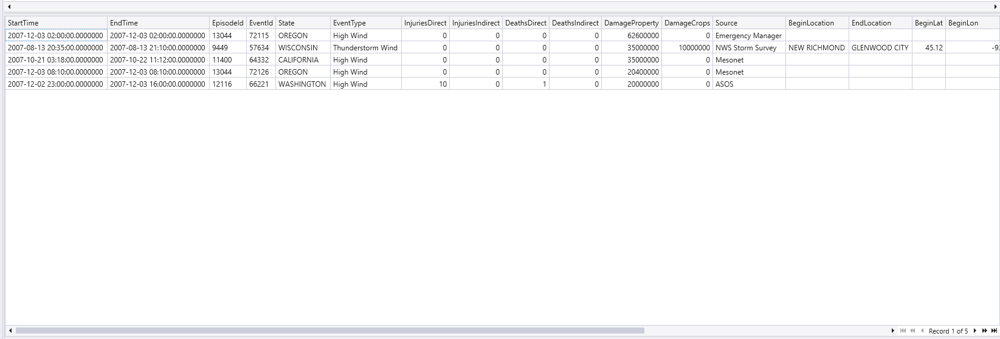

<!-- Start Document Outline -->

* [Explore StormEvents Database](#explore-stormevents-database)
	* [1. getschema operator](#1-getschema-operator)
	* [2. Run StormEvents Table](#2-run-stormevents-table)
	* [3. take/limit Operator](#3-takelimit-operator)
	* [4. Count records in the table](#4-count-records-in-the-table)
	* [5. Where Operator](#5-where-operator)
	* [6. Find events that caused damage to crops.](#6-find-events-that-caused-damage-to-crops)
	* [7. Find events that caused damage to property/crops in Florida](#7-find-events-that-caused-damage-to-propertycrops-in-florida)
	* [8. Find events that caused most damage to property](#8-find-events-that-caused-most-damage-to-property)
	* [9. Find events involving wind that cost most damage to property](#9-find-events-involving-wind-that-cost-most-damage-to-property)
	* [10. Find events that caused damage to property in Florida in Q1 of 2007](#10-find-events-that-caused-damage-to-property-in-florida-in-q1-of-2007)
		* [1. Query Purpose](#1-query-purpose)
		* [2. Step-by-Step Execution](#2-step-by-step-execution)
			* [a. Data Source Selection](#a-data-source-selection)
			* [b. Time Filtering](#b-time-filtering)
			* [c. Damage and Location Filtering](#c-damage-and-location-filtering)
			* [d. Column Selection](#d-column-selection)
			* [e. Result Limiting](#e-result-limiting)

<!-- End Document Outline -->


# Explore StormEvents Database

Storm Events table contains data from old storms that happened in the United States in the year 2007.

## 1. *getschema* operator
* How do we know what’s available for querying in these tables?
* What data is stored in the StormEvents table?
* The most useful functions you can run when interacting with a new data source is getschema.
* This will produce a list of all the columns in the table and their data types.


## 2. Run *StormEvents* Table

Entire table is executed, provides all the data from the table.

Query:
```plaintext
StormEvents
```


## 3. *take/limit* Operator
* The *take* operator or the *limit* operator will return a specific number of rows you specified without guaranteeing which records are returned.
* The *take* operator or the *limit* operator are functionally the same thing.
* There is no difference, and you can use whatever one you prefer.
* They do not guarantee consistency in the results. You can rerun the same query and likely see different results returned, even if the data set didn’t change.
* No sorting is performed on this data.

Query:

```plaintext
StormEvents
| take 5

StormEvents
| limit 5
```


## 4. *Count* records in the table
Produce total count of the records in the table.

Query:
```plaintext
StormEvents
| count
```

## 5. *Where* Operator
* The where operator allows you to filter a table to the subset of rows that satisfy your expression.
* You will compare three main types of data: ***strings***, ***numeric/dates***, and what we’ll call “***is empty***”.

Query:
```plaintext
StormEvents
| where EventType == "Winter Storm"
```


## 6. Find events that caused damage to crops.
We can check the DamageCrops is greater than 0.

Query:
```plaintext
StormEvents
| where DamageCrops > 0
| take 10
```


## 7. Find events that caused damage to property/crops in Florida

We can check the *DamageCrops* and *DamageProperty* is greater than 0.

Query:

```plaintext
StormEvents
| where DamageCrops > 0 and DamageProperty > 0
| where State == "FLORIDA"
```


## 8. Find events that caused most damage to property

Events that caused most damage to property, selecting top 5 rows.

Query:

```plaintext
StormEvents
| top 5 by DamageProperty desc
```


## 9. Find events involving wind that cost most damage to property

Any events with word "wind" that cost most damage to property, selecting top 5 rows.

Query:

```plaintext
StormEvents
| where EventType has "wind"
| top 5 by DamageProperty desc
```


## 10. Find events that caused damage to property in Florida in Q1 of 2007

Query:

```plaintext
StormEvents
| where StartTime between (datetime(2007-01-01) .. datetime(2007-03-31))
| where (DamageProperty > 0) and (State == "FLORIDA")
| project StartTime, EventType, DamageProperty
| take 50
```


This query is analyzing storm events that caused property damage in Florida during the first quarter of 2007.

### 1. Query Purpose
The comment at the top explains this is looking for:

* Events causing property damage
* In Florida
* During Q1 2007 (January 1 - March 31)


### 2. Step-by-Step Execution
#### a. Data Source Selection
`StormEvents` - This selects the table containing storm event data as the source for the query.

#### b. Time Filtering
`| where StartTime between (datetime(2007-01-01) .. datetime(2007-03-31))`

* Filters events to only those that occurred between January 1, 2007 and March 31, 2007.
* The between operator is inclusive of both dates.

#### c. Damage and Location Filtering
`| where (DamageProperty > 0) and (State == "FLORIDA")`

* `DamageProperty > 0` ensures we only get events that caused some property damage.
* `State == "FLORIDA"` restricts results to Florida only.
* Combined with `and` means both conditions must be true.

#### d. Column Selection
`| project StartTime, EventType, DamageProperty`

Selects only these three columns for the output:

* `StartTime:` When the event occurred.
* `EventType:` What type of storm event it was.
* `DamageProperty:` Amount of property damage caused.

#### e. Result Limiting
`| take 50`

* Limits the output to the first 50 records that match all the criteria.
* This prevents returning potentially large result sets.

## 11. See total damage per state

Query:

```plaintext
StormEvents
| extend Damage = DamageProperty + DamageCrops
| summarize sum(Damage) by State
| top 10 by sum_Damage desc
```


### Detailed Explanation of the KQL Query

This KQL (Kusto Query Language) query analyzes storm event data to identify the top 10 states with the highest total damage (combining property and crop damage). Let's break it down step by step:

#### 1. Data Source: `StormEvents`
- The query starts with the `StormEvents` table, which presumably contains records of various storm events with columns like `DamageProperty`, `DamageCrops`, and `State`.

#### 2. `extend Damage = DamageProperty + DamageCrops`
- The `extend` operator creates a new calculated column called `Damage` for each record.
- This new column sums two existing columns: `DamageProperty` (property damage) and `DamageCrops` (crop damage).
- This combines both types of damage into a single metric for each storm event.

#### 3. `summarize sum(Damage) by State`
- The `summarize` operator aggregates the data.
- `sum(Damage)` calculates the total damage (the sum of all Damage values we created in the previous step) for each unique value in the `State` column.
- This gives us the combined property and crop damage totals per state.

#### 4. `top 10 by sum_Damage desc`
- The `top` operator limits the results to just the top 10 records.
- It sorts by the aggregated column `sum_Damage` (which was automatically named from our `sum(Damage)` operation) in descending order (`desc`).
- This shows us the 10 states with the highest total storm damage.

#### Output:
The final output will be a table with two columns:
1. `State` - The name of the state
2. `sum_Damage` - The total combined property and crop damage for that state

The results will be ordered from the state with the highest damage total at the top to the 10th highest at the bottom.


