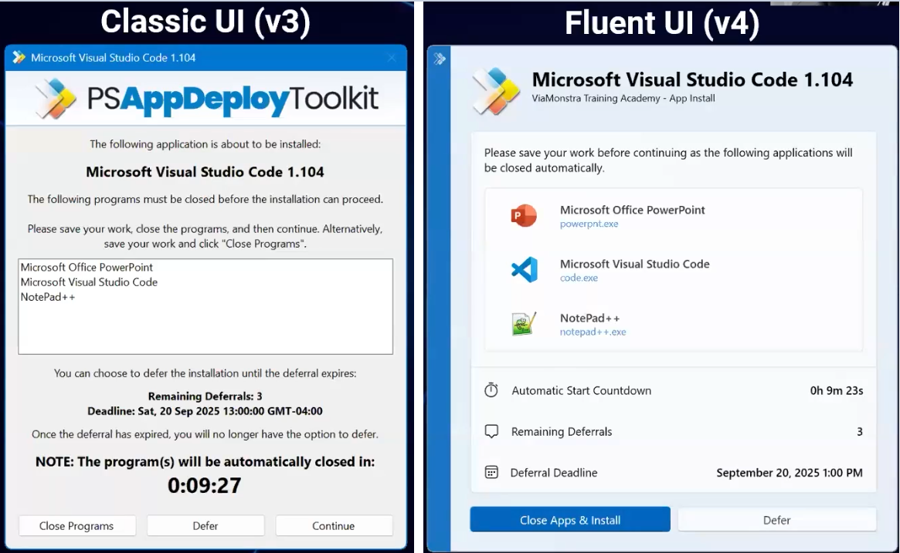

# Powershell AppDeploy Toolkit v4
<!-- Start Document Outline -->

* [Powershell AppDeploy Toolkit v4](#powershell-appdeploy-toolkit-v4)
	* [What is PSAppDeployToolkit ?](#what-is-psappdeploytoolkit-)
	* [Standardized Workflow](#standardized-workflow)
	* [User Experience](#user-experience)
	* [Functions Library](#functions-library)
	* [Improvements since PSADT v3](#improvements-since-psadt-v3)
	* [Function Names](#function-names)

<!-- End Document Outline -->
## What is PSAppDeployToolkit ?

A PowerShell framework for Windows software deployment.

Typically used to wrap a vendor-supplied installer using:
* A standardized workflow for every App Install / Uninstall / Repair.
* A consistent User Interface for every deployment.
* A library of PowerShell functions to simplify common tasks.
* That consistently results in highly successful deployments.

## Standardized Workflow

A prescriptive, best practice, and battle-tested workflow:

* A widely adopted standard for enterprise deployment.
* Fully tested on all supported versions of Microsoft Windows.
* Integrates with SCCM, Intune, PatchMy PC, Installshield, Master Packager and many others.
* Automatic logging of every action taken.
* Reduces the time and effort required to package an app.
* Extensive online community support.

## User Experience

A consistent, brandable and localizable User Interface:

* Allow deferral of the installation to a more suitable time.
* Ensure applications are closed prior to install.
* Prevent re-opening apps during installation.
* Display installation progress to indicate there is activity.
* Prompt for reboot on completion.
* Configurable icon and text for corporate branding and messaging.

## Functions Library

A library of PowerShell functions for common deployment tasks:

* Copy files, edit registry, modify ACLs with ease.
* Manage both user and system files and registry keys.
* Run processes and install applications (both as system & user).
* Start, stop and configure Windows Services.
* Modify environment variables.
* Register DLL files.
* Find and uninstall applications by name, publisher, version, etc.
* Manage Active Setup and auto-run for the current user.
* Create or remove Start Menu and desktop shortcuts.
* Check if PowerPoint is running, or if the microphone is in use.
* Test for pending reboots, and much more.

## Improvements since PSADT v3
Major functional changes from v3 to v4:

* Still 100% free, and still 100% open source via LGPLv3.
* Now distributed as a code-signed PowerShell module.
* Supports PowerShell 7 and ARM64 devices.
* Operates entirely in PowerShell strict mode v3.
* Every function name has changed.
* We’ve made migrating as easy as possible:
* Backwards compatibility layer allows use of existing v3 scripts (no Fluent UI).
* Migration tool will convert existing v3 script to v4 format.

***You’ll never need to use ServiceUI ever again****

* New security architecture enables new capabilities.
* ADMX (Group Policy) templates enables centralized config.
* Fluent UI now supports all Classic UI features, and more.
* Request for user input now possible through custom dialog box.
* Dialog text can now contain clickable URLs.
* Support for formatting dialog text with bold, italic and accent text.
* Literally hundreds of improvements, features and fixes.

Improvements since PSADT v4

* ***this assumes you want to use the PSADT User Interface to interact with the end user.**
> LGPLv3 (GNU Lesser General Public License v3) is an open-source software license that permits users to run, study, and redistribute software for any purpose.

## Function Names

* All function names are renamed in version V4.
* The listed table is for comparison for the versions 3.10.2 and 4.1.5.

<table>
<thead>
	<tr>
		<th style="background-color: #42a4f5;">3.10.2</th>
		<th style="background-color: #42a4f5;">4.1.5</th>
	</tr>
</thead>
<tbody>
	<tr>
		<td>Block-AppExecution</td>
		<td>Add-ADTEdgeExtension</td>
	</tr>
	<tr>
		<td>Close-InstallationProgress</td>
		<td>Add-ADTModuleCallback</td>
	</tr>
	<tr>
		<td>Configure-EdgeExtension</td>
		<td>Block-ADTAppExecution</td>
	</tr>
	<tr>
		<td>Convert-RegistryPath</td>
		<td>Clear-ADTModuleCallback</td>
	</tr>
	<tr>
		<td>ConvertTo-NTAccountOrSID</td>
		<td>Close-ADTInstallationProgress</td>
	</tr>
	<tr>
		<td>Copy-ContentToCache</td>
		<td>Close-ADTSession</td>
	</tr>
	<tr>
		<td>Copy-File</td>
		<td>Complete-ADTFunction</td>
	</tr>
	<tr>
		<td>Copy-FileToUserProfiles</td>
		<td>Convert-ADTRegistryPath</td>
	</tr>
	<tr>
		<td>Disable-TerminalServerInstallMode</td>
		<td>Convert-ADTValuesFromRemainingArguments</td>
	</tr>
	<tr>
		<td>Enable-TerminalServerInstallMode</td>
		<td>Convert-ADTValueType</td>
	</tr>
	<tr>
		<td>Execute-MSI</td>
		<td>ConvertTo-ADTNTAccountOrSID</td>
	</tr>
	<tr>
		<td>Execute-MSP</td>
		<td>Copy-ADTContentToCache</td>
	</tr>
	<tr>
		<td>Execute-Process</td>
		<td>Copy-ADTFile</td>
	</tr>
	<tr>
		<td>Execute-ProcessAsUser</td>
		<td>Copy-ADTFileToUserProfiles</td>
	</tr>
	<tr>
		<td>Exit-Script</td>
		<td>Disable-ADTTerminalServerInstallMode</td>
	</tr>
	<tr>
		<td>Get-DeferHistory</td>
		<td>Dismount-ADTWimFile</td>
	</tr>
	<tr>
		<td>Get-FileVersion</td>
		<td>Enable-ADTTerminalServerInstallMode</td>
	</tr>
	<tr>
		<td>Get-FreeDiskSpace</td>
		<td>Export-ADTEnvironmentTableToSessionState</td>
	</tr>
	<tr>
		<td>Get-HardwarePlatform</td>
		<td>Get-ADTApplication</td>
	</tr>
	<tr>
		<td>Get-IniValue</td>
		<td>Get-ADTBoundParametersAndDefaultValues</td>
	</tr>
	<tr>
		<td>Get-InstalledApplication</td>
		<td>Get-ADTCommandTable</td>
	</tr>
	<tr>
		<td>Get-LoggedOnUser</td>
		<td>Get-ADTConfig</td>
	</tr>
	<tr>
		<td>Get-MsiExitCodeMessage</td>
		<td>Get-ADTDeferHistory</td>
	</tr>
	<tr>
		<td>Get-MsiTableProperty</td>
		<td>Get-ADTEnvironment</td>
	</tr>
	<tr>
		<td>Get-ObjectProperty</td>
		<td>Get-ADTEnvironmentTable</td>
	</tr>
	<tr>
		<td>Get-PEFileArchitecture</td>
		<td>Get-ADTEnvironmentVariable</td>
	</tr>
	<tr>
		<td>Get-PendingReboot</td>
		<td>Get-ADTExecutableInfo</td>
	</tr>
	<tr>
		<td>Get-PinVerb</td>
		<td>Get-ADTFileVersion</td>
	</tr>
	<tr>
		<td>Get-RegistryKey</td>
		<td>Get-ADTFreeDiskSpace</td>
	</tr>
	<tr>
		<td>Get-RunningProcesses</td>
		<td>Get-ADTIniSection</td>
	</tr>
	<tr>
		<td>Get-SchedulerTask</td>
		<td>Get-ADTIniValue</td>
	</tr>
	<tr>
		<td>Get-ServiceStartMode</td>
		<td>Get-ADTLoggedOnUser</td>
	</tr>
	<tr>
		<td>Get-Shortcut</td>
		<td>Get-ADTModuleCallback</td>
	</tr>
	<tr>
		<td>Get-UniversalDate</td>
		<td>Get-ADTMsiExitCodeMessage</td>
	</tr>
	<tr>
		<td>Get-UserProfiles</td>
		<td>Get-ADTMsiTableProperty</td>
	</tr>
	<tr>
		<td>Get-WindowTitle</td>
		<td>Get-ADTObjectProperty</td>
	</tr>
	<tr>
		<td>Install-MSUpdates</td>
		<td>Get-ADTOperatingSystemInfo</td>
	</tr>
	<tr>
		<td>Install-SCCMSoftwareUpdates</td>
		<td>Get-ADTPEFileArchitecture</td>
	</tr>
	<tr>
		<td>Invoke-HKCURegistrySettingsForAllUsers</td>
		<td>Get-ADTPendingReboot</td>
	</tr>
	<tr>
		<td>Invoke-ObjectMethod</td>
		<td>Get-ADTPowerShellProcessPath</td>
	</tr>
	<tr>
		<td>Invoke-RegisterOrUnregisterDLL</td>
		<td>Get-ADTPresentationSettingsEnabledUsers</td>
	</tr>
	<tr>
		<td>Invoke-SCCMTask</td>
		<td>Get-ADTRegistryKey</td>
	</tr>
	<tr>
		<td>Invoke-Verb</td>
		<td>Get-ADTRunningProcesses</td>
	</tr>
	<tr>
		<td>New-Folder</td>
		<td>Get-ADTServiceStartMode</td>
	</tr>
	<tr>
		<td>New-MsiTransform</td>
		<td>Get-ADTSession</td>
	</tr>
	<tr>
		<td>New-Shortcut</td>
		<td>Get-ADTShortcut</td>
	</tr>
	<tr>
		<td>New-ZipFile</td>
		<td>Get-ADTStringTable</td>
	</tr>
	<tr>
		<td>Remove-ContentFromCache</td>
		<td>Get-ADTUniversalDate</td>
	</tr>
	<tr>
		<td>Remove-File</td>
		<td>Get-ADTUserNotificationState</td>
	</tr>
	<tr>
		<td>Remove-FileFromUserProfiles</td>
		<td>Get-ADTUserProfiles</td>
	</tr>
	<tr>
		<td>Remove-Folder</td>
		<td>Get-ADTWindowTitle</td>
	</tr>
	<tr>
		<td>Remove-InvalidFileNameChars</td>
		<td>Initialize-ADTFunction</td>
	</tr>
	<tr>
		<td>Remove-MSIApplications</td>
		<td>Initialize-ADTModule</td>
	</tr>
	<tr>
		<td>Remove-RegistryKey</td>
		<td>Install-ADTMSUpdates</td>
	</tr>
	<tr>
		<td>Resolve-Error</td>
		<td>Install-ADTSCCMSoftwareUpdates</td>
	</tr>
	<tr>
		<td>Resolve-Parameters</td>
		<td>Invoke-ADTAllUsersRegistryAction</td>
	</tr>
	<tr>
		<td>Send-Keys</td>
		<td>Invoke-ADTCommandWithRetries</td>
	</tr>
	<tr>
		<td>Set-ActiveSetup</td>
		<td>Invoke-ADTFunctionErrorHandler</td>
	</tr>
	<tr>
		<td>Set-DeferHistory</td>
		<td>Invoke-ADTObjectMethod</td>
	</tr>
	<tr>
		<td>Set-IniValue</td>
		<td>Invoke-ADTRegSvr32</td>
	</tr>
	<tr>
		<td>Set-ItemPermission</td>
		<td>Invoke-ADTSCCMTask</td>
	</tr>
	<tr>
		<td>Set-MsiProperty</td>
		<td>Mount-ADTWimFile</td>
	</tr>
	<tr>
		<td>Set-PinnedApplication</td>
		<td>New-ADTErrorRecord</td>
	</tr>
	<tr>
		<td>Set-RegistryKey</td>
		<td>New-ADTFolder</td>
	</tr>
	<tr>
		<td>Set-ServiceStartMode</td>
		<td>New-ADTMsiTransform</td>
	</tr>
	<tr>
		<td>Set-Shortcut</td>
		<td>New-ADTShortcut</td>
	</tr>
	<tr>
		<td>Show-BalloonTip</td>
		<td>New-ADTTemplate</td>
	</tr>
	<tr>
		<td>Show-DialogBox</td>
		<td>New-ADTValidateScriptErrorRecord</td>
	</tr>
	<tr>
		<td>Show-InstallationProgress</td>
		<td>New-ADTZipFile</td>
	</tr>
	<tr>
		<td>Show-InstallationPrompt</td>
		<td>Open-ADTSession</td>
	</tr>
	<tr>
		<td>Show-InstallationRestartPrompt</td>
		<td>Out-ADTPowerShellEncodedCommand</td>
	</tr>
	<tr>
		<td>Show-InstallationWelcome</td>
		<td>Register-ADTDll</td>
	</tr>
	<tr>
		<td>Show-WelcomePrompt</td>
		<td>Remove-ADTContentFromCache</td>
	</tr>
	<tr>
		<td>Start-ServiceAndDependencies</td>
		<td>Remove-ADTEdgeExtension</td>
	</tr>
	<tr>
		<td>Stop-ServiceAndDependencies</td>
		<td>Remove-ADTEnvironmentVariable</td>
	</tr>
	<tr>
		<td>Test-Battery</td>
		<td>Remove-ADTFile</td>
	</tr>
	<tr>
		<td>Test-IsMutexAvailable</td>
		<td>Remove-ADTFileFromUserProfiles</td>
	</tr>
	<tr>
		<td>Test-MSUpdates</td>
		<td>Remove-ADTFolder</td>
	</tr>
	<tr>
		<td>Test-NetworkConnection</td>
		<td>Remove-ADTHashtableNullOrEmptyValues</td>
	</tr>
	<tr>
		<td>Test-PowerPoint</td>
		<td>Remove-ADTIniSection</td>
	</tr>
	<tr>
		<td>Test-RegistryValue</td>
		<td>Remove-ADTIniValue</td>
	</tr>
	<tr>
		<td>Test-ServiceExists</td>
		<td>Remove-ADTInvalidFileNameChars</td>
	</tr>
	<tr>
		<td>Unblock-AppExecution</td>
		<td>Remove-ADTModuleCallback</td>
	</tr>
	<tr>
		<td>Update-Desktop</td>
		<td>Remove-ADTRegistryKey</td>
	</tr>
	<tr>
		<td>Update-GroupPolicy</td>
		<td>Reset-ADTDeferHistory</td>
	</tr>
	<tr>
		<td>Update-SessionEnvironmentVariables</td>
		<td>Resolve-ADTErrorRecord</td>
	</tr>
	<tr>
		<td>Write-FunctionHeaderOrFooter</td>
		<td>Send-ADTKeys</td>
	</tr>
	<tr>
		<td>Write-Log</td>
		<td>Set-ADTActiveSetup</td>
	</tr>
	<tr>
		<td></td>
		<td>Set-ADTDeferHistory</td>
	</tr>
	<tr>
		<td></td>
		<td>Set-ADTEnvironmentVariable</td>
	</tr>
	<tr>
		<td></td>
		<td>Set-ADTIniSection</td>
	</tr>
	<tr>
		<td></td>
		<td>Set-ADTIniValue</td>
	</tr>
	<tr>
		<td></td>
		<td>Set-ADTItemPermission</td>
	</tr>
	<tr>
		<td></td>
		<td>Set-ADTMsiProperty</td>
	</tr>
	<tr>
		<td></td>
		<td>Set-ADTPowerShellCulture</td>
	</tr>
	<tr>
		<td></td>
		<td>Set-ADTRegistryKey</td>
	</tr>
	<tr>
		<td></td>
		<td>Set-ADTServiceStartMode</td>
	</tr>
	<tr>
		<td></td>
		<td>Set-ADTShortcut</td>
	</tr>
	<tr>
		<td></td>
		<td>Show-ADTBalloonTip</td>
	</tr>
	<tr>
		<td></td>
		<td>Show-ADTDialogBox</td>
	</tr>
	<tr>
		<td></td>
		<td>Show-ADTHelpConsole</td>
	</tr>
	<tr>
		<td></td>
		<td>Show-ADTInstallationProgress</td>
	</tr>
	<tr>
		<td></td>
		<td>Show-ADTInstallationPrompt</td>
	</tr>
	<tr>
		<td></td>
		<td>Show-ADTInstallationRestartPrompt</td>
	</tr>
	<tr>
		<td></td>
		<td>Show-ADTInstallationWelcome</td>
	</tr>
	<tr>
		<td></td>
		<td>Start-ADTMsiProcess</td>
	</tr>
	<tr>
		<td></td>
		<td>Start-ADTMsiProcessAsUser</td>
	</tr>
	<tr>
		<td></td>
		<td>Start-ADTMspProcess</td>
	</tr>
	<tr>
		<td></td>
		<td>Start-ADTMspProcessAsUser</td>
	</tr>
	<tr>
		<td></td>
		<td>Start-ADTProcess</td>
	</tr>
	<tr>
		<td></td>
		<td>Start-ADTProcessAsUser</td>
	</tr>
	<tr>
		<td></td>
		<td>Start-ADTServiceAndDependencies</td>
	</tr>
	<tr>
		<td></td>
		<td>Stop-ADTServiceAndDependencies</td>
	</tr>
	<tr>
		<td></td>
		<td>Test-ADTBattery</td>
	</tr>
	<tr>
		<td></td>
		<td>Test-ADTCallerIsAdmin</td>
	</tr>
	<tr>
		<td></td>
		<td>Test-ADTEspActive</td>
	</tr>
	<tr>
		<td></td>
		<td>Test-ADTMicrophoneInUse</td>
	</tr>
	<tr>
		<td></td>
		<td>Test-ADTModuleInitialized</td>
	</tr>
	<tr>
		<td></td>
		<td>Test-ADTMSUpdates</td>
	</tr>
	<tr>
		<td></td>
		<td>Test-ADTMutexAvailability</td>
	</tr>
	<tr>
		<td></td>
		<td>Test-ADTNetworkConnection</td>
	</tr>
	<tr>
		<td></td>
		<td>Test-ADTOobeCompleted</td>
	</tr>
	<tr>
		<td></td>
		<td>Test-ADTPowerPoint</td>
	</tr>
	<tr>
		<td></td>
		<td>Test-ADTRegistryValue</td>
	</tr>
	<tr>
		<td></td>
		<td>Test-ADTServiceExists</td>
	</tr>
	<tr>
		<td></td>
		<td>Test-ADTSessionActive</td>
	</tr>
	<tr>
		<td></td>
		<td>Test-ADTUserIsBusy</td>
	</tr>
	<tr>
		<td></td>
		<td>Unblock-ADTAppExecution</td>
	</tr>
	<tr>
		<td></td>
		<td>Uninstall-ADTApplication</td>
	</tr>
	<tr>
		<td></td>
		<td>Unregister-ADTDll</td>
	</tr>
	<tr>
		<td></td>
		<td>Update-ADTDesktop</td>
	</tr>
	<tr>
		<td></td>
		<td>Update-ADTEnvironmentPsProvider</td>
	</tr>
	<tr>
		<td></td>
		<td>Update-ADTGroupPolicy</td>
	</tr>
	<tr>
		<td></td>
		<td>Write-ADTLogEntry</td>
	</tr>
</tbody>
</table>

