<!-- Start Document Outline -->

* [Exploring IMDB Dataset MySQL](#exploring-imdb-dataset-mysql)
	* [1. SHOW Tables](#1-show-tables)
	* [2. DESCRIBE](#2-describe)
	* [3. SELECT](#3-select)
	* [4. LIMIT and OFFSET](#4-limit-and-offset)
	* [5. ORDER BY](#5-order-by)
	* [6. DISTINCT](#6-distinct)
	* [7. WHERE](#7-where)
	* [8. LOGICAL Operator](#8-logical-operator)
	* [9. AGGREGATE Functions](#9-aggregate-functions)

<!-- End Document Outline -->

# Exploring IMDB Dataset MySQL

## 1. SHOW Tables
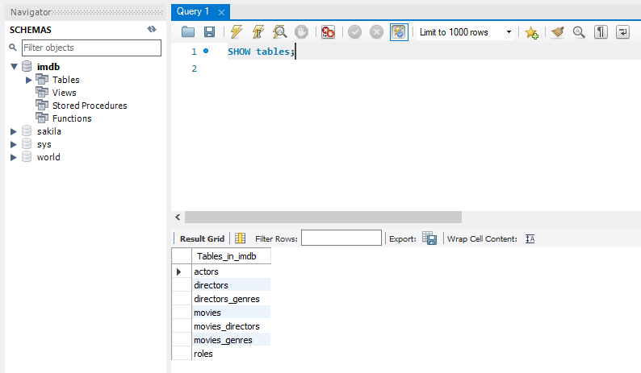

Lists out the tables from the database.

## 2. DESCRIBE

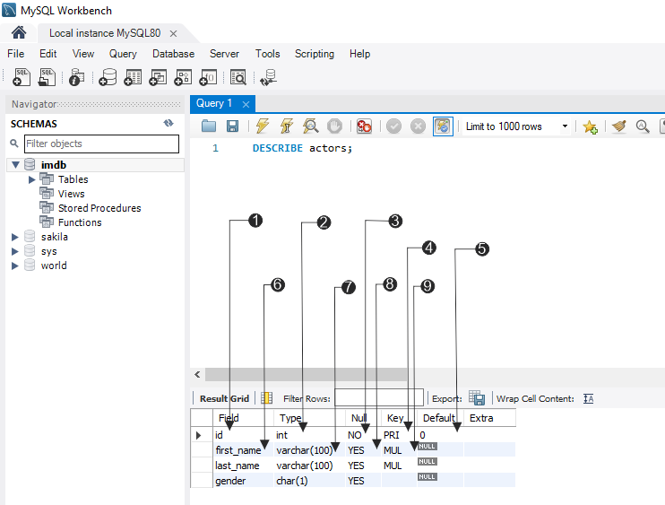

To understand each of the tables we need to use keyword DESCRIBE which means understanding each of the field about its `data type`, whether it can be `NULL`, whether it can be `primary key` or it can have `MUL`.

1. **Field:** `id`: This column is used to store a unique identifier for each actor record.
2. **Type:** `int`: This defines the data type for the column. int stands for integer, meaning this column can only hold whole numbers (e.g., 1, 456, -12).
3. **Null:** `NO`: This indicates if the column is allowed to have NULL values. NO means this column cannot be empty or NULL.
4. **Key:** `PRI`: This shows that the id column is the Primary Key (PRI) for this table.
5. **Default:** `0`: If a value for the id column is not specified when inserting a new actor record, the database will automatically use the value 0.
6. **Field:** `first_name`:The name of the column, designed to store the actor's first name.
7. **Type:** `varchar(100)`: A variable-length character string with a maximum length of 100 characters.
8. **Null:** `YES`: The column is allowed to have NULL values, meaning a first name is optional for an actor record.
9. **Key:** `MUL`: MUL is an abbreviation for "multiple". It is NOT a Primary Key. The "multiple" means the index allows duplicate values.
> Multiple values can be present or in other words first name can be same for two different actors there could be two Johnnies... or there could be two Davids". 

## 3. SELECT
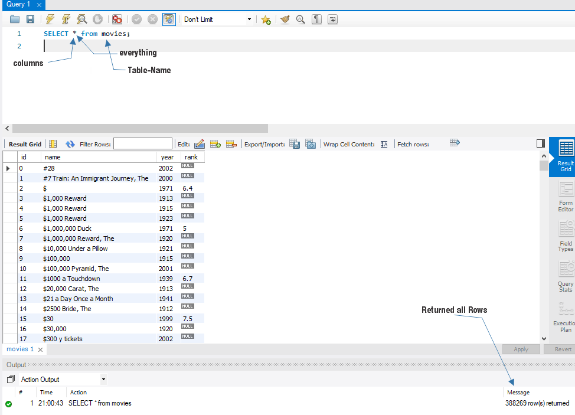
* `SELECT` is used to retrieve the data from the table. 
* `SELECT` can be used to retrieve all the columns using `*` and also be used to retrieve specific columns, example: 
```sql
SELECT id, rank from movies;
```
## 4. LIMIT and OFFSET

* `LIMIT` is used to retrieve number of rows from the table. Here `LIMIT 10` specifies to retrieve first 10 rows.
```sql
SELECT name, `rank` FROM movies LIMIT 10;
```
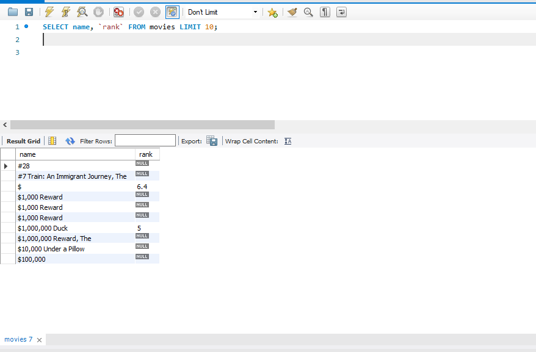
* Here `rank` is a column name quoted with backtick as in SQL `rank` also specifies `Keyword`. In order to get the rank column we need to use backtick to escape the `keyword`.
* `OFFSET` is used to skip a specified number of rows before starting to return rows from a query.
```sql
SELECT name, `rank` FROM movies LIMIT 5 OFFSET 5;
```
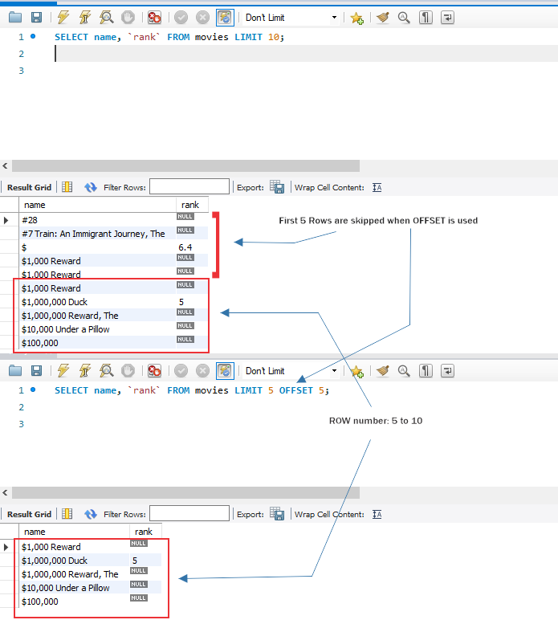
* Here the first 5 rows are skipped and next 5 rows are retrieved, that is from row 6 to 10.

## 5. ORDER BY

* `ORDER BY` is used to sort the data in ascending or descending order. 

```sql
SELECT name, `rank`, year FROM movies ORDER BY year DESC LIMIT 10;
```
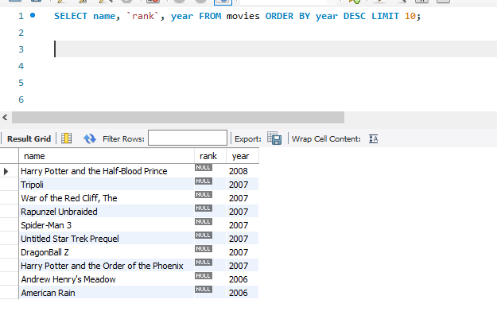


* Here the columns name, rank and year are retrieved from movies table and as `ORDER BY` keyword used which performs the sorting operation using the year column in descending order, which means it retrieves the top 10 latest movies. 
* By default `ORDER BY` sorting is ascending order if `DESC` is not provided.

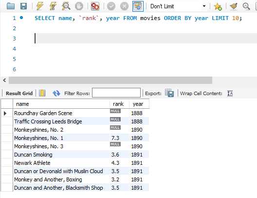

## 6. DISTINCT

* `DISTINCT` is used to return unique values from a specified column or multiple columns in a table. 

```sql
SELECT genre FROM movies_genres;
```
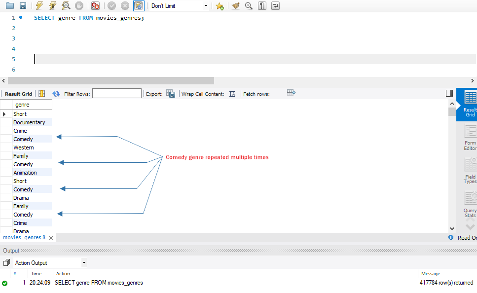

* Here we can see Comedy genre repeated multiple times, it is obvious that the comedy genre is associated with unique Movie id's. 
* In order to remove the duplicates we can use `DISTINCT` keyword.
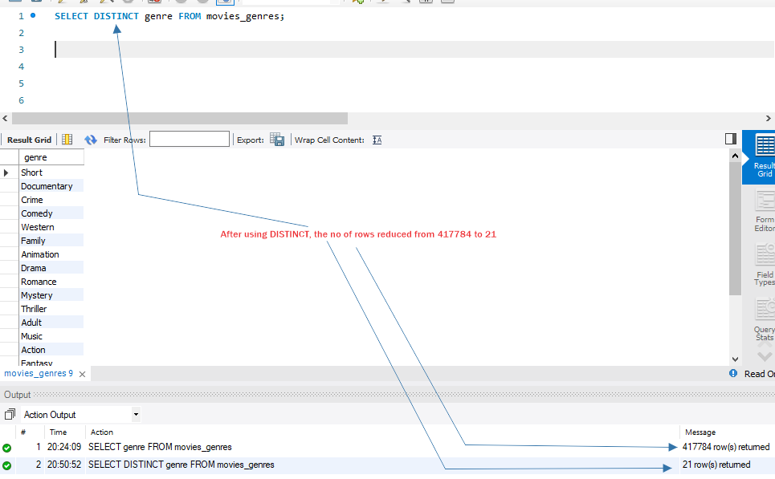

* Here we can see the number of genre rows reduced from 417884 to 21, that is now we have 21 unique genre. 

## 7. WHERE

* `WHERE` is used to filter a table based on the specified condition. 
* Condition outputs: TRUE, FALSE, NULL.

* **List all movies with rank score > 9** 
```sql
SELECT * FROM movies WHERE `rank` > 9;
```
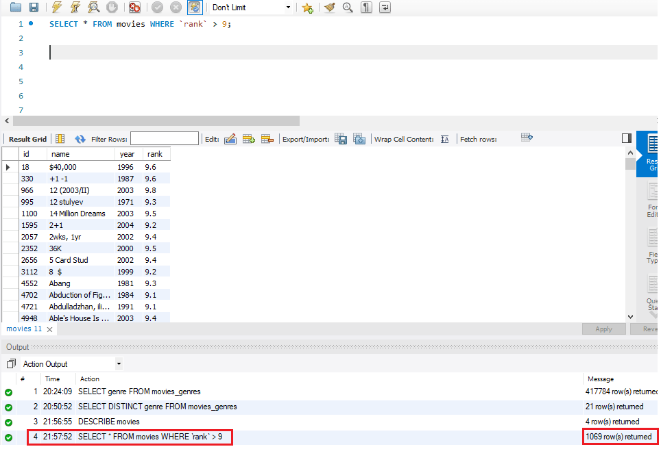

* Comparison operators: `=, <> or !=, <, <=, >, >=` 
 ```sql
SELECT * FROM movies_genres WHERE genre = 'comedy';
```


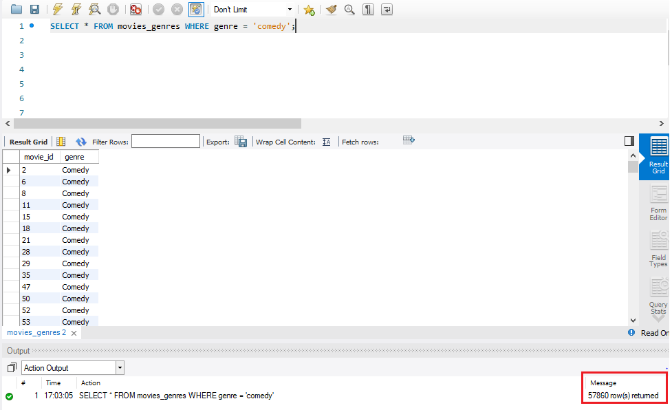

* `NULL` is keyword in SQL which means `"does not exist/unknown/missing"`
* `"="` doesnot work with `NULL` will give us the empty result set.

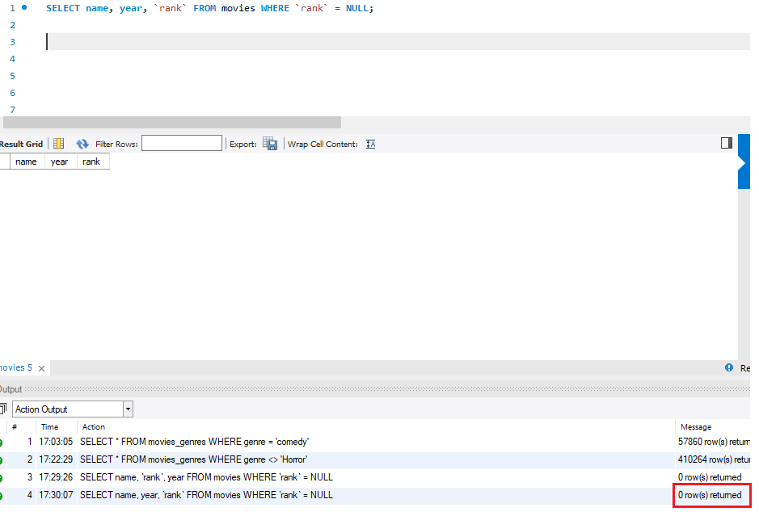
* Here we can see `rank = NULL` gives us the empty result &rarr; `0` rows returned.
* To check `rank = NULL` we need to use `IS NULL`.
```sql
SELECT name, year, `rank` FROM movies WHERE `rank` IS NULL LIMIT 15;
```
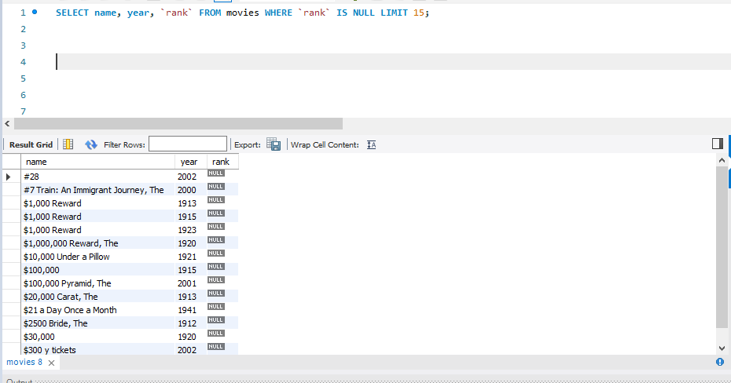

* To check `rank != NULL` we need to use `IS NOT NULL`. 

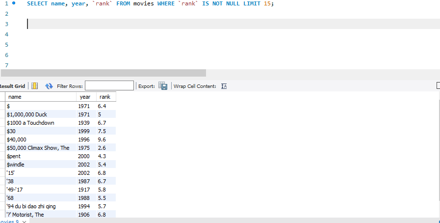

## 8. LOGICAL Operator

**Logical Operators:** `AND, OR, NOT, ALL, ANY, BETWEEN, EXISTS, IN, LIKE, SOME`

```sql
SELECT name, year, `rank` FROM movies WHERE `rank` > 9 AND year > 2000 LIMIT 10;
```
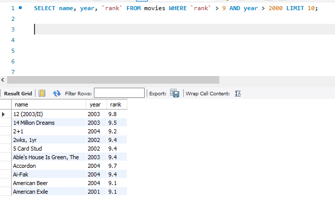

```sql
SELECT name, year, `rank` FROM movies WHERE NOT year <= 2000 LIMIT 10;
```

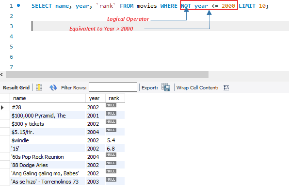

## 9. AGGREGATE Functions

* **AGGREGATE function:** computes a single value on a set of rows and returns the aggregate. 
* **AGGREGATE function:** `COUNT, MIN, MAX, SUM, AVG`.

```sql
SELECT MIN(year) FROM movies;
```

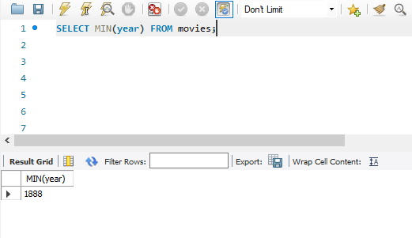

* There could be number of columns with year 1888, the aggregate MIN computes the entire columns and returns only the minimum year as a single value. 

```sql
SELECT MAX(year) FROM movies;
```

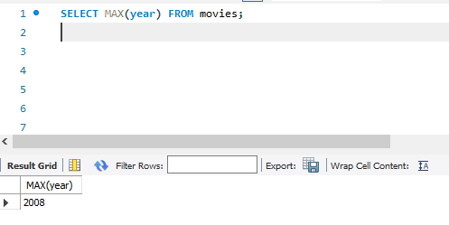

* There could be number of columns with year 2008, the aggregate MAX computes the entire columns and returns only the maximum year as a single value. 

```sql
SELECT COUNT(*) FROM movies;
```

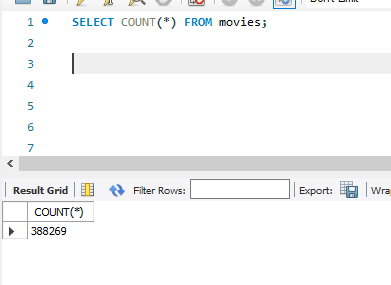

* Here `Count *` indicates entire column from the movies table and it returned total number of rows as 388269.

```sql
SELECT COUNT(*) FROM movies WHERE year = 2000;
```

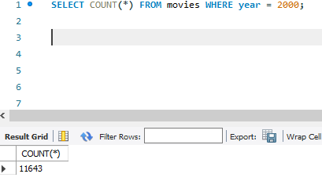

* Here `Count *` indicates entire column from the movies table and there is filter for year = 2008, which means the total number of movies for the year 2008 which returned as 11643.