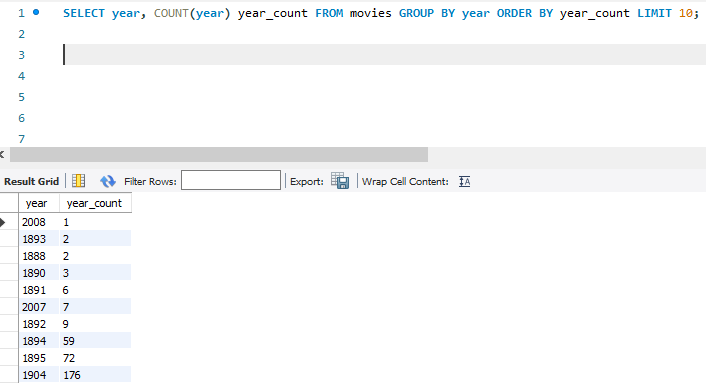
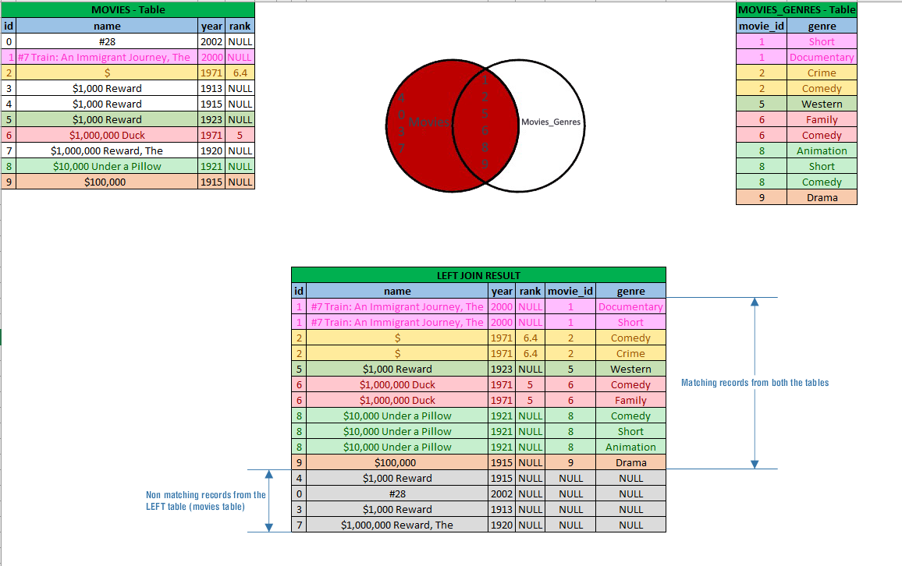

<!-- Start Document Outline -->

* [Exploring IMDB Dataset MySQL](#exploring-imdb-dataset-mysql)
	* [1. SHOW Tables](#1-show-tables)
	* [2. DESCRIBE](#2-describe)
	* [3. SELECT](#3-select)
	* [4. LIMIT and OFFSET](#4-limit-and-offset)
	* [5. ORDER BY](#5-order-by)
	* [6. DISTINCT](#6-distinct)
	* [7. WHERE](#7-where)
	* [8. LOGICAL Operator](#8-logical-operator)
	* [9. AGGREGATE Functions](#9-aggregate-functions)
	* [10. GROUP BY](#10-group-by)
	* [11. HAVING](#11-having)
	* [12. Order of Keywords](#12-order-of-keywords)
	* [13. INNER JOIN](#13-inner-join)
	* [14. LEFT OUTER JOIN or LEFT JOIN](#14-left-outer-join-or-left-join)

<!-- End Document Outline -->
# Exploring IMDB Dataset MySQL

## 1. SHOW Tables


Lists out the tables from the database.

## 2. DESCRIBE


To understand each of the tables we need to use keyword DESCRIBE which means understanding each of the field about its `data type`, whether it can be `NULL`, whether it can be `primary key` or it can have `MUL`.

1. **Field:** `id`: This column is used to store a unique identifier for each actor record.
2. **Type:** `int`: This defines the data type for the column. int stands for integer, meaning this column can only hold whole numbers (e.g., 1, 456, -12).
3. **Null:** `NO`: This indicates if the column is allowed to have NULL values. NO means this column cannot be empty or NULL.
4. **Key:** `PRI`: This shows that the id column is the Primary Key (PRI) for this table.
5. **Default:** `0`: If a value for the id column is not specified when inserting a new actor record, the database will automatically use the value 0.
6. **Field:** `first_name`:The name of the column, designed to store the actor's first name.
7. **Type:** `varchar(100)`: A variable-length character string with a maximum length of 100 characters.
8. **Null:** `YES`: The column is allowed to have NULL values, meaning a first name is optional for an actor record.
9. **Key:** `MUL`: MUL is an abbreviation for "multiple". It is NOT a Primary Key. The "multiple" means the index allows duplicate values.
> Multiple values can be present or in other words first name can be same for two different actors there could be two Johnnies... or there could be two Davids". 

## 3. SELECT

* `SELECT` is used to retrieve the data from the table. 
* `SELECT` can be used to retrieve all the columns using `*` and also be used to retrieve specific columns, example: 
```sql
SELECT id, rank from movies;
```
## 4. LIMIT and OFFSET

* `LIMIT` is used to retrieve number of rows from the table. Here `LIMIT 10` specifies to retrieve first 10 rows.
```sql
SELECT name, `rank` FROM movies LIMIT 10;
```

* Here `rank` is a column name quoted with backtick as in SQL `rank` also specifies `Keyword`. In order to get the rank column we need to use backtick to escape the `keyword`.
* `OFFSET` is used to skip a specified number of rows before starting to return rows from a query.
```sql
SELECT name, `rank` FROM movies LIMIT 5 OFFSET 5;
```

* Here the first 5 rows are skipped and next 5 rows are retrieved, that is from row 6 to 10.

## 5. ORDER BY

* `ORDER BY` is used to sort the data in ascending or descending order. 

```sql
SELECT name, `rank`, year FROM movies ORDER BY year DESC LIMIT 10;
```


* Here the columns name, rank and year are retrieved from movies table and as `ORDER BY` keyword used which performs the sorting operation using the year column in descending order, which means it retrieves the top 10 latest movies. 
* By default `ORDER BY` sorting is ascending order if `DESC` is not provided.


## 6. DISTINCT

* `DISTINCT` is used to return unique values from a specified column or multiple columns in a table. 

```sql
SELECT genre FROM movies_genres;
```


* Here we can see Comedy genre repeated multiple times, it is obvious that the comedy genre is associated with unique Movie id's. 
* In order to remove the duplicates we can use `DISTINCT` keyword.


* Here we can see the number of genre rows reduced from 417884 to 21, that is now we have 21 unique genre. 

## 7. WHERE

* `WHERE` is used to filter a table based on the specified condition. 
* Condition outputs: TRUE, FALSE, NULL.

* **List all movies with rank score > 9** 
```sql
SELECT * FROM movies WHERE `rank` > 9;
```


* Comparison operators: `=, <> or !=, <, <=, >, >=` 
 ```sql
SELECT * FROM movies_genres WHERE genre = 'comedy';
```


* `NULL` is keyword in SQL which means `"does not exist/unknown/missing"`
* `"="` doesnot work with `NULL` will give us the empty result set.


* Here we can see `rank = NULL` gives us the empty result &rarr; `0` rows returned.
* To check `rank = NULL` we need to use `IS NULL`.
```sql
SELECT name, year, `rank` FROM movies WHERE `rank` IS NULL LIMIT 15;
```


* To check `rank != NULL` we need to use `IS NOT NULL`. 


## 8. LOGICAL Operator

**Logical Operators:** `AND, OR, NOT, ALL, ANY, BETWEEN, EXISTS, IN, LIKE, SOME`

```sql
SELECT name, year, `rank` FROM movies WHERE `rank` > 9 AND year > 2000 LIMIT 10;
```


```sql
SELECT name, year, `rank` FROM movies WHERE NOT year <= 2000 LIMIT 10;
```


## 9. AGGREGATE Functions

* **AGGREGATE function:** computes a single value on a set of rows and returns the aggregate. 
* **AGGREGATE function:** `COUNT, MIN, MAX, SUM, AVG`.

```sql
SELECT MIN(year) FROM movies;
```


* There could be number of columns with year 1888, the aggregate MIN computes the entire columns and returns only the minimum year as a single value. 

```sql
SELECT MAX(year) FROM movies;
```


* There could be number of columns with year 2008, the aggregate MAX computes the entire columns and returns only the maximum year as a single value. 

```sql
SELECT COUNT(*) FROM movies;
```


* Here `Count *` indicates entire column from the movies table and it returned total number of rows as 388269.

```sql
SELECT COUNT(*) FROM movies WHERE year = 2000;
```


* Here `Count *` indicates entire column from the movies table and there is filter for year = 2008, which means the total number of movies for the year 2008 which returned as 11643.

## 10. GROUP BY

* `GROUP BY` is used to group the records based on our requirements.

```sql
SELECT year, COUNT(year) FROM movies GROUP BY year;
```


* Here the records are grouped based on the year, for instance year `2002` has `12056` records which means `12056` movies were released in year `2002`. 

```sql
SELECT year, COUNT(year) FROM movies GROUP BY year ORDER BY year LIMIT 10;
```


* Here the query is same as the previous query, the only difference is we have `ORDER BY` year, which provides the result in ascending order by default. 

```sql
SELECT year, COUNT(year) year_count FROM movies GROUP BY year ORDER BY year_count LIMIT 10;
```



* Here we have alias `year_count` for `COUNT(year)` in the query in order to use `ORDER BY` for `COUNT(year)`.
* If the grouping column has `NULL` values, all the `NULL` values are grouped together.

## 11. HAVING

* **HAVING:** is used to filter groups (group by).
* The listed query is to print year, year_count from the movies table which has movies released more than 1000 in a year.

```sql
SELECT year, COUNT(year) year_count FROM movies GROUP BY year HAVING year_count > 1000;
```


***Order of Execution:***

1. `GROUP BY` to create groups
2. Apply the AGGREGATE FUNCTION &rarr; `COUNT(year)`.
3. Apply `HAVING` condition.

* `HAVING` used along with `GROUP BY`. But not mandatory. 
* `HAVING` without `GROUP BY` is same as `WHERE`.

```sql
SELECT name, year FROM movies HAVING year>2000;
```


* The listed query is to print year, year_count from the movies table where its movie `rank` > 9, `group by` year and `year_count` > 20 which means movies released should be > 20 in a year for the movie rank > 9.

```sql
SELECT year, COUNT(year) year_count FROM movies WHERE `rank` > 9 GROUP BY year HAVING year_count>20;
```


| HAVING                            | WHERE                                |
|-----------------------------------|--------------------------------------|
| `HAVING` is applied on groups.      | `WHERE` is applied on individual rows. |
| `HAVING` is applied after grouping. | `WHERE` is used before grouping.       |

## 12. Order of Keywords

***MySQL Syntax:*** 

We can see the order of keywords from the listed syntax **FROM &rarr; JOIN &rarr;  WHERE &rarr; GROUP BY &rarr; HAVING &rarr; SELECT &rarr;  ORDER BY &rarr; LIMIT**

```sql
SELECT
    [ALL | DISTINCT | DISTINCTROW ]
    [HIGH_PRIORITY]
    [STRAIGHT_JOIN]
    [SQL_SMALL_RESULT] [SQL_BIG_RESULT] [SQL_BUFFER_RESULT]
    [SQL_NO_CACHE] [SQL_CALC_FOUND_ROWS]
    select_expr [, select_expr] ...
    [into_option]
    [FROM table_references
      [PARTITION partition_list]]
    [WHERE where_condition]
    [GROUP BY {col_name | expr | position}, ... [WITH ROLLUP]]
    [HAVING where_condition]
    [WINDOW window_name AS (window_spec)
        [, window_name AS (window_spec)] ...]
    [ORDER BY {col_name | expr | position}
      [ASC | DESC], ... [WITH ROLLUP]]
    [LIMIT {[offset,] row_count | row_count OFFSET offset}]
    [into_option]
    [FOR {UPDATE | SHARE}
        [OF tbl_name [, tbl_name] ...]
        [NOWAIT | SKIP LOCKED]
      | LOCK IN SHARE MODE]
    [into_option]

into_option: {
    INTO OUTFILE 'file_name'
        [CHARACTER SET charset_name]
        export_options
  | INTO DUMPFILE 'file_name'
  | INTO var_name [, var_name] ...
}

export_options:
    [{FIELDS | COLUMNS}
        [TERMINATED BY 'string']
        [[OPTIONALLY] ENCLOSED BY 'char']
        [ESCAPED BY 'char']
    ]
    [LINES
        [STARTING BY 'string']
        [TERMINATED BY 'string']
    ]
```

## 13. INNER JOIN

* Returns only matching records from both the table. 

```sql
SELECT * FROM movies m JOIN movies_genres g ON m.id = g.movie_id 
WHERE m.id <=9;
```
* **m** represents alias for `movies` table, **g** represents alias for `movies_genres` table.
* Here `m.id` and `g.movie_id` has common elements so we can use these id's to join both the tables.
* JOIN and INNER JOIN both are equivalent.

**RESULT:**


* The matching records **{1,2,5,6,8,9}** from the both tables are returned. 

```sql
SELECT m.name, g.genre FROM movies m JOIN movies_genres g ON m.id = g.movie_id 
WHERE m.id <=9;
```


* In this query only difference is we printed **name** columns from `movies` table and **genre** column from `movies_genres` table. Where as in previous query we printed * all columns from both tables.

## 14. LEFT OUTER JOIN or LEFT JOIN

* Returns all records from **A&#8594;Movies (table)** and matching ones from **B&#8594;Movies_genres (table)**.
* Non matching records from `Movies_genres` table is marked as `NULL`.

```sql
SELECT * FROM movies m LEFT JOIN movies_genres g ON m.id = g.movie_id 
WHERE m.id <=9;
```




* Here `{1,2,5,6,8,9}` are matching records and `{4,0,3,7}` in `Movies` table are non matching records in `Movies_genres` table. 