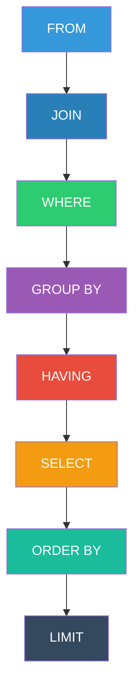

# SQL BASICS

## Processing Flow

### 1. FROM
It is used to specify the tables from which data fetched.
### 2. JOIN
It is used to combine data from tables based on a common field.
### 3. WHERE
It is used to filter the records based on the given condition.
### 4. GROUP BY
It is used to group the records based on our requirements.
### 5. HAVING
It is used to filter groups.
### 6. SELECT
It is used to retrieve the data from the table.
### 7. ORDER BY
It is used to sort the data in ascending or descending order.
### 8. LIMIT
It is used to specify how many rows are returned.

